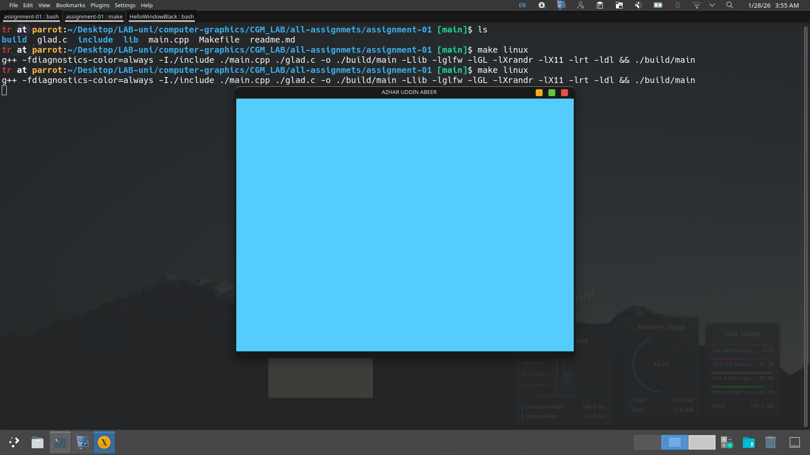

## 🚀 Lab 01: OpenGL Window Creation

### 📋 Assignment Description
Create a cyan-colored OpenGL window displaying the student's full name as the window title. The program should close the window when the user presses the keyboard key corresponding to the first letter of their name (in this case, 'A' or 'a').

### ✅ Requirements Fulfilled
1. ✅ Created a dedicated GitHub repository for CGM course
2. ✅ Cyan-colored OpenGL window (RGB: 0, 1, 1)
3. ✅ Window title displays "Azhar" as required
4. ✅ Window closes when 'A' or 'a' key is pressed
5. ✅ Proper code formatting and comments
6. ✅ Original work created and tested locally
7. ✅ README file with comprehensive documentation
8. ✅ Screenshot of output with VS Code terminal

### 🔧 Program Features
- **Graphics Library**: OpenGL with GLUT
- **Window Properties**:
- Size: 800x600 pixels
- Color: Cyan (0.0, 1.0, 1.0)
- Title: "Azhar Uddin"
- **Keyboard Interaction**: Press 'A' or 'a' to exit
- **Platform**: Cross-platform (Windows/Linux/macOS)

### 📁 Project Structure
```
CGM_LAB/
│
├── main.cpp              # Main OpenGL program
├── README.md             # This documentation file
├── output_screenshot.png # Screenshot of program execution
```

### 🛠️ Compilation and Execution

#### Prerequisites
- OpenGL development libraries
- GLUT (FreeGLUT recommended)
- C++ compiler (g++/MinGW/MSVC)

#### Linux/Mac Compilation
```bash
make linux
```

#### Windows Compilation (MinGW)
```bash
make win
```

### 📸 Screenshot Information
The screenshot (`output.png`) demonstrates:
1. VS Code terminal showing compilation and execution
2. Cyan OpenGL window with title "Azhar"
3. Folder structure with Azhar's name
4. Program running successfully on local machine(Linux)




### 💻 Code Implementation Details
The program uses:
- `glutInit()` to initialize GLUT
- `glutCreateWindow()` to create window with name
- `glClearColor()` to set cyan background
- `glutKeyboardFunc()` for keyboard input handling
- Clean exit using `exit(0)` on key press

### 📚 Learning Outcomes
- Understanding OpenGL/GLUT window management
- Implementing keyboard callbacks in graphics applications
- Working with color models in computer graphics
- Setting up development environment for graphics programming


### 📅 Submission Details
- **Assignment**: Computer Graphics & Multimedia Lab 
- **Submission Date**: January 25, 2026
- **Deadline**: January 28, 2025, 8:00 AM
- **Submission Method**: GitHub repository link and screenshot


