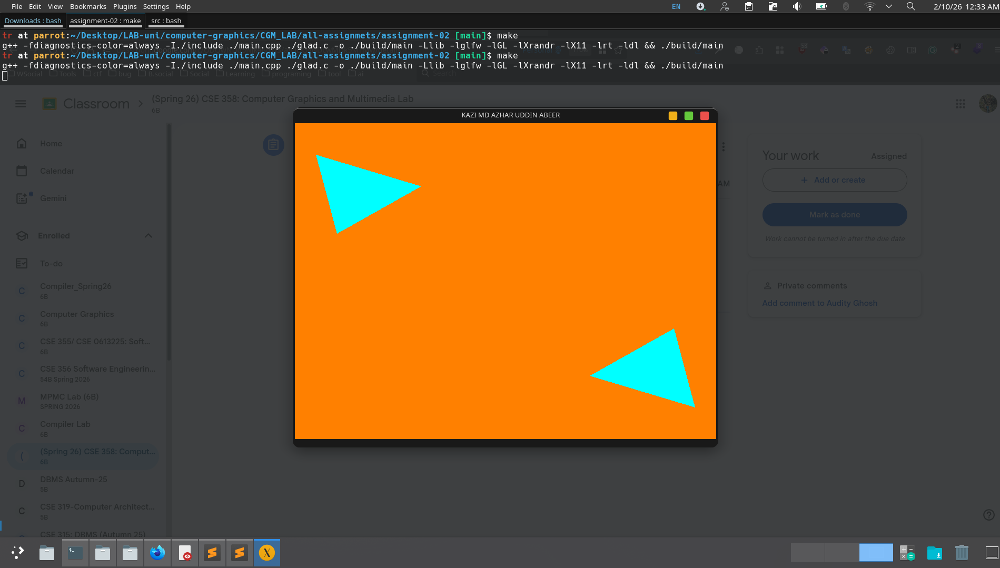

## 🚀 Lab 02: Drawing Two Cyan Obtuse Triangles Using OpenGL

### 📋 Assignment Description

Develop an OpenGL application that renders **two cyan-colored obtuse triangles** positioned at **two distant corners of the screen** on an **orange background**.
The program window must display the **student’s full name as the title** and should **terminate when the user presses the first letter of their name** on the keyboard.

---

### ✅ Requirements Fulfilled

1. ✅ Created a dedicated GitHub repository for CGM course
2. ✅ Orange background window (RGB: 1.0, 0.5, 0.0)
3. ✅ Two **cyan-colored obtuse triangles** rendered using OpenGL
4. ✅ Triangles positioned at **top-left** and **bottom-right** corners
5. ✅ Window title displays student’s **full name**
6. ✅ Window closes when the **initial letter of the name** is pressed
7. ✅ Used **GLFW + GLAD** (Modern OpenGL Core Profile)
8. ✅ Proper code structure, formatting, and comments
9. ✅ Original work implemented and tested locally
10. ✅ README documentation and output screenshot attached

---

### 🔧 Program Features

* **Graphics Library**: OpenGL 3.3 Core Profile
* **Window Management**: GLFW
* **Function Loader**: GLAD

**Window Properties**

* Size: `800 × 600` pixels
* Background Color: **Orange** `(1.0, 0.5, 0.0)`
* Title: **	KAZI MD AZHAR UDDIN ABEER**

**Rendering**

* Two **cyan obtuse triangles**
* Rendered using `glDrawArrays(GL_TRIANGLES)`
* Vertex Array Object (VAO) and Vertex Buffer Object (VBO) used

**Keyboard Interaction**

* Press **first letter of your name** (e.g., `K`) to close the window

**Platform**

* Linux / Windows / macOS (cross-platform)

---

### 📁 Project Structure

```
Hello_Tri_One_Triangle_Red_Colored/
│
├── main.cpp          # OpenGL source code
│   
│
├── README.md             # Project documentation
├── output.png            # Screenshot of program output
```

---

### 🛠️ Compilation and Execution

#### Prerequisites

* OpenGL development libraries
* GLFW
* GLAD
* C++ compiler (g++ recommended)

#### Linux Compilation

```bash
g++ main.cpp -o triangles -lglfw -lGL -ldl
./triangles
```

#### Windows (MinGW)

```bash
g++ main.cpp -o triangles.exe -lglfw3 -lopengl32 -lgdi32
```

---

### 📸 Screenshot Information

The attached screenshot (`output.png`) shows:

1. Successful compilation in terminal
2. OpenGL window with **orange background**
3. Two **cyan obtuse triangles** at opposite corners
4. Window title displaying student’s full name



---

### 💻 Code Implementation Details

The program uses:

* `glfwInit()` for window initialization
* `glfwCreateWindow()` to create a named OpenGL window
* `glClearColor()` to set orange background
* Custom **vertex and fragment shaders**
* VAO & VBO for vertex management
* `glfwGetKey()` for keyboard input handling
* Graceful cleanup using `glDelete*()` and `glfwTerminate()`

---

### 📚 Learning Outcomes

* Understanding Modern OpenGL rendering pipeline
* Drawing multiple primitives using vertex buffers
* Shader compilation and linking
* Keyboard input handling with GLFW
* Proper OpenGL resource management
* Structuring a graphics project for academic submission

---

### 📅 Submission Details

* **Course**: Computer Graphics & Multimedia Lab
* **Lab No**: 01
* **Assignment Title**: Drawing Two Cyan Obtuse Triangles
* **Submission Method**: GitHub repository link
* **Attachments**: `main.cpp` + output screenshot
* **Deadline**: As announced (No exception)

