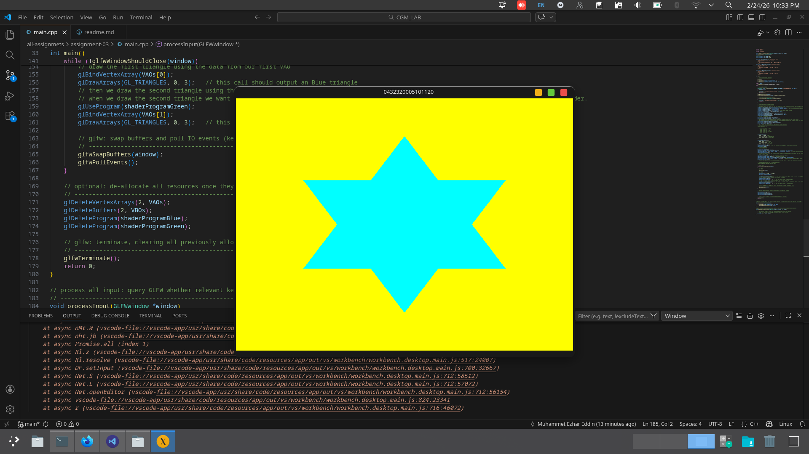

# Assignment 04: Interactive Color Animation & Keyboard Input

**Course**  
Computer Graphics & Multimedia Lab

**Assignment**  
Assignment 04

**Student**  
Name: Md. Azhar Uddin Abeer  
Student ID: 0432320005101120

**Submission Date**  
April 2026

## Objective

Develop an interactive modern OpenGL application using **GLFW** and **GLAD** that demonstrates dynamic color interpolation and keyboard event handling:

- **Color Animation**: The triangle color smoothly interpolates between **Cyan** (0, 1, 1) and **Magenta** (1, 0, 1) over time using a sine-based transition.
- **Interactive State**:
    - Holding **`W`**: Changes the triangle color to **White** temporarily.
    - Pressing **`R`**: Changes the triangle color to **Red** permanently and stops the animation.
- **Window Title**: Displays the student's ID suffix: **1120**.
- **Exit Logic**: Closes the window when the user presses **`A`** (initial of the student's name) or **`ESC`**.

## Requirements Fulfilled

- [x] **Dynamic Animation**: Smooth interpolation between Cyan and Magenta.
- [x] **Keyboard Interactivity**: 
    - [x] Temporary color change (`W`).
    - [x] Permanent state change (`R`).
- [x] **Custom Exit Key**: Closes on `A`.
- [x] **Modern Pipeline**: Uses OpenGL 3.3 Core Profile with custom shaders and VAO/VBO.
- [x] **Documentation**: Clean code with student-specific identifiers.
- [x] **Proof of Work**: Included GIF and Screenshot.

## Program Specifications

| Property              | Value                                      |
|-----------------------|--------------------------------------------|
| Window size           | 800 × 600 pixels                           |
| Background color      | Dark Gray (0.1f, 0.1f, 0.1f, 1.0f)        |
| Animation Colors      | Cyan ↔ Magenta                             |
| Window title          | 1120                                       |
| Rendering primitive   | `GL_TRIANGLES`                             |
| Exit key              | `A` or `ESC`                               |
| Special keys          | `W` (White), `R` (Red)                     |
| OpenGL version        | 3.3 Core Profile                           |

## Project Structure

```
assignment-04/
├── main.cpp                Main program (Animation + Input Logic)
├── glad.c                  GLAD source
├── include/                Headers (glad.h, glfw3.h)
├── lib/                    GLFW library files
├── build/                  Executable output
├── readme.md               This documentation
├── output.png              Static screenshot
└── assignment-04..gif      Recorded animation/interaction proof
```

## Build & Run Instructions

### Linux

```bash
# Compile
g++ -Wall -std=c++17 \
    -I./include \
    main.cpp glad.c \
    -o build/main \
    -L./lib -lglfw -lGL -lX11 -lpthread -lXrandr -lXi -ldl

# Run
./build/main
```

## Program Output

The application features a dark background where a central triangle cycles through colors. Pressing interaction keys modifies the rendering state in real-time.

**Interaction Demo:**

  
*GIF showing the Cyan-Magenta animation and keyboard interaction responses*

**Screenshot:**

  
*Static view of the triangle in its default state*

## Key Techniques Implemented

- **Uniform Color Updates**: Used `glUniform4f` to pass dynamically calculated colors to the fragment shader.
- **Sine Interpolation**: Implemented `(sin(time) + 1.0) / 2.0` to create a smooth looping transition between two color vectors.
- **Input Polling**: Used `glfwGetKey` for both momentary (holding `W`) and persistent (toggle `isRedPermanently`) state management.
- **Resource Cleanup**: Proper destruction of VAO, VBO, and Shader Program upon exit.

## Learning Outcomes

- Gained proficiency in **Uniforms** for real-time GPU data communication.
- Learned to manage **application states** (permanent vs. temporary) based on user input.
- Mastered **time-based animations** within the render loop.
- Strengthened understanding of the **OpenGL 3.3 Core Profile** workflow.

## Submission Details

- **Student**: Md. Azhar Uddin Abeer  
- **ID**: 0432320005101120
- **Lab Instructor**: Any Chowdhury - AC  

---
*Thank you for reviewing my Assignment 04 submission.*
